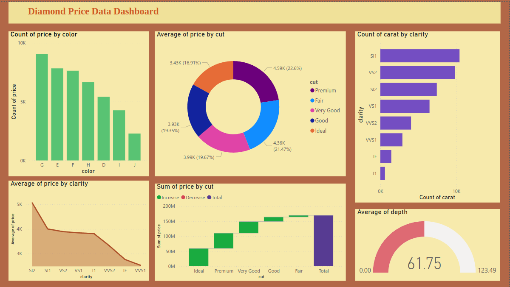

# Diamond Price Dataset:

this is the dataset on Kaggle:
[https://www.kaggle.com/competitions/shai-club/data?select=train.csv]

- Features:

Carat: The carat weight of the diamond.

Cut: Describes the cut quality of the diamond, with quality levels ranging from Fair to Ideal.

Color: Indicates the color of the diamond, with D being the best and J being the worst.

Clarity: Represents the clarity of the diamond, ranging from FL (flawless) to I3 (level 3 inclusions).

Depth: The height of the diamond, measured from the Culet to the table, divided by its average Girdle Diameter.

Table: The width of the diamond's table is expressed as a percentage of its average diameter.

Price: The price of the diamond (target variable).

X: Length of the diamond in millimeters.

Y: Width of the diamond in millimeters.

Z: Height of the diamond in millimeters.

- Data Types:

Qualitative Features (Categorical): Cut, Color, Clarity.

Quantitative Features (Numerical): Carat, Depth, Table, Price, X, Y, Z.

## In this notebook:
I have conducted a comprehensive analysis of this dataset to uncover insights and patterns related to diamond characteristics and their influence on pricing. To enhance the accessibility and understanding of the data.

## Dashboard:
I have also developed a user-friendly dashboard. This dashboard provides visualizations and summaries that facilitate a deeper understanding of the dataset, making it a powerful tool for strategic decision-making in credit card marketing.

You can access the interactive dashboard here: [https://app.powerbi.com/view?r=eyJrIjoiZDA5MmZmYTYtODlhNS00NjIzLTg2ZDgtN2Y2M2I2OGE3YzUyIiwidCI6IjVmYjg0ZTZlLTNlOTctNDBlNC05NGVmLWE0YmVlYTg5NDkxMiIsImMiOjl9]

and this is the dashboard image:

 

